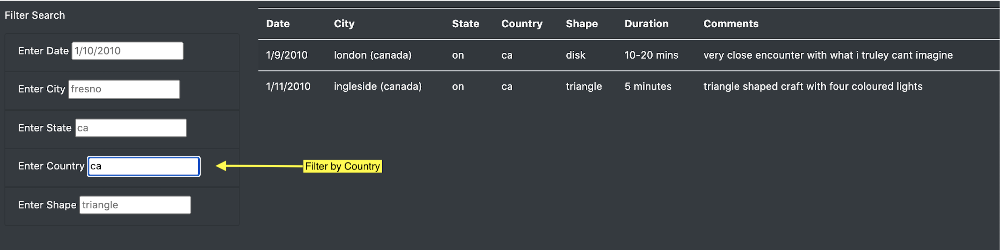
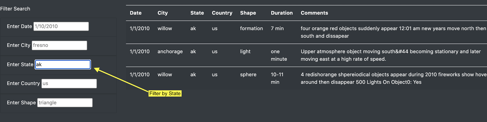
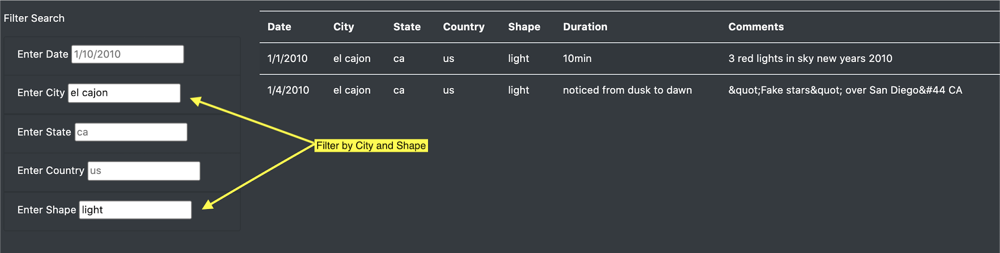
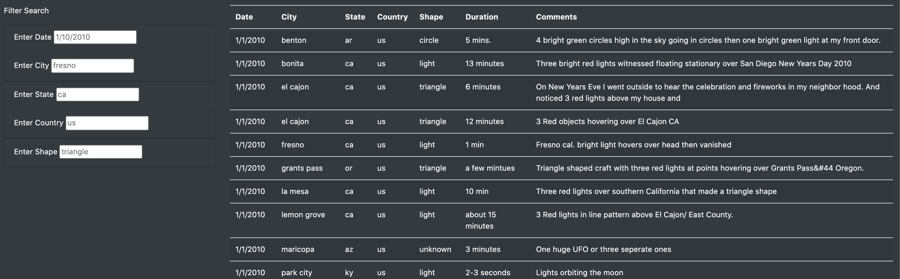

# UFO Sightings with JavaScript

# Overview of Project

The project aimed to create a dynamic web page with an article and an informative table of data concerning UFO sightings. The outline of the web page was made using HTML code while Bootstrap and CSS elements were added to improve its format and style. Javascript code was inserted into the HTML file in order to import the data and display it as a table on the web page. Several table filters were also added using the D3 library of Javascript. This enabled users to narrow down their search results by specific categories such as country, city, state, date, and UFO sighting shape.

# Results

    <strong>Load the Webpage</strong>  
    

First load the webpage in order to see the header, the article, the unfiltered table and the filter search boxes.  

    <strong>Searching by Individual Categories</strong>  
    
    

Narrow search results by entering a desired date, city, state, country or UFO sighting shape in the respective textbox following the indicated input format of the grayed out placeholders.

    <strong>Searching by Multiple Categories</strong>  
    

Specific search results using multiple catgeories can be obtained by specifying more than one category in the search boxes. The filter will be implemented either when the user presses enter on the keyboard or navigates to another text box.

    <strong>Clear Filters</strong>  
    

Users can view the unfiltered table either by manually clearing all the text boxes or by clicking the navigation bar called UFO Sightings on the upper left corner of the screen.

# Summary

## Drawback 

One drawback of the page is that all the text boxes require users to provide an input that exactly matches the data in data.js in order to successfully filter the table by the specified category. For instance, when the table is filtered for the country "ca", two rows will be displayed while none will be returned when "CA" is used instead. Another example is the city filter "boca raton" which results in one row being returned. Any variations of this word such as "boca", "Boca Raton" or even "boca_ _ raton" with two white spaces in between as opposed to one will not successfully filter the table. Although placeholders in the textboxes indicate specific formats for user input such as date, they cannot completely capture all the formats of the other categories such as places. 

This is inconvenient for the user especially for large data sets since they will have to manually scroll through the table to look at how a specific category is written before entering it in the text box. This defeats the whole purpose of filtering. 

## Recommendations

To improve the filtering process, the text boxes can be replaced with drop down menus. This allows the user to quickly glance at all the present values under a specific filter category without having to scroll through the entire table. It also eliminates the need for the user to enter a filter value following a specific format. 

Another improvement could be the addition of a search results count. This will benefit users who are more interested in how many results satisfy their filter criteria rather than the results themselves. This can be easily done in the the app.js file by finding the length of the filteredData array of objects after the filters have been applied. 

